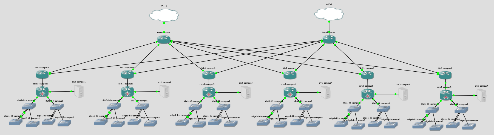

# NSRC Virtual Training Platform - GNS3 configurations

Download `cndo.gns3project`.  This is a GNS3 "portable project" which you
should be able to import using `File > Import Portable Project`.
import into another GNS3 server.

The topology is formed of 6 campuses, each with a border router, core
router, 2 distribution switches, and 4 edge switches.  The border routers
are connected to two NREN transit routers.



# Images required

## IOSv

The following IOSv images need to be uploaded separately:

* `vios-adventerprisek9-m.vmdk.SPA.156-2.T` (md5sum: 4e94f3e63ad2771e5662f614921c8c62)
* `3017a0ae-c895-432b-9611-1325ef7828e3` (IOSvL2 15.2.4063, md5sum: c9d556c75a3aa510443014c5dea3dbdb)

## Ubuntu Cloud

For the time being, this topology uses the vanilla
[ubuntu-cloud GNS3 appliance](https://raw.githubusercontent.com/GNS3/gns3-registry/master/appliances/ubuntu-cloud.gns3a)

## Cloud-init ISO images

The [iso/](iso) directory contains the ISO images which are attached to the
CD-ROM drive on `srv1-campus{1..6}` when they boot up.  This assigns the
correct static IP address, creates the `sysadm` account, and configures
use of apt-cacher on 192.168.122.1.

# Snapshots

GNS3 is currently [unable to import IOSv configs](https://github.com/GNS3/gns3-server/issues/1315).

This repo contains scripts to generate snapshots, which take the form of zip files.
Unfortunately, GNS3 changes the UUIDs of nodes when a portable project
is imported - so you cannot import a project and then just copy the snapshot
into place.  Right now this only works if you run the scripts on the machine
where the project has already been imported; you can then copy the snapshots
manually into `~/GNS3/projects/<uuid>/snapshots/`

The scripts assume that your GNS3 `images` directory is
`/var/lib/GNS3/images`, as it creates qcow2 difference files which point to
backing files at an absolute directory.

If you have already run GNS3 then move your existing images directory:

```
sudo mkdir /var/lib/GNS3
sudo mv ~/GNS3/images /var/lib/GNS3/
```

Point to the new location by creating the [configuration file](https://docs.gns3.com/1f6uXq05vukccKdMCHhdki5MXFhV8vcwuGwiRvXMQvM0/)
`~/.config/GNS3/gns3_server.conf` so that it contains:

```
[Server]
images_path = /var/lib/GNS3/images
```

(Or you could instead make a symlink: `ln -s /var/lib/GNS3/images ~/GNS3/images`)

If you see the following error:

```
libguestfs: error: /usr/bin/supermin exited with error status 1.
```

then this may just be a permissions problem which can be fixed by:

```
sudo chmod +r /boot/vmlinuz-*
```

Once snapshots are built, you can copy them into the project:

```
cp cndo/snapshots/<name>.gns3project ~/GNS3/projects/<uuid>/snapshots/
```

Restart the backend to pick them up, and then they should be visible in
"Manage Snapshots" in the GUI, to restore from.

# Host configuration

The host needs a `virbr0` bridge on network 192.168.122.  This is most
easily obtained by installing the `libvirt-bin` package.

Once you have done this, use `virsh net-edit default` to edit the default
DHCP range to use addresses only up to 192.168.122.199.  You can also add a
static route.  After changes it looks like this:

```
<network>
  <name>default</name>
  <uuid>...</uuid>
  <forward mode='nat'>
    <nat>
      <port start='1024' end='65535'/>
    </nat>
  </forward>
  <bridge name='virbr0' stp='on' delay='0'/>
  <mac address='...'/>
  <ip address='192.168.122.1' netmask='255.255.255.0' localPtr='yes'>
    <dhcp>
      <range start='192.168.122.2' end='192.168.122.199'/>
    </dhcp>
  </ip>
  <route address='100.64.0.0' prefix='10' gateway='192.168.122.254'/>
</network>
```

TODO: fix routing.  May require updating from `nat` to `route` and adding
manual forwarding and NAT rules.
