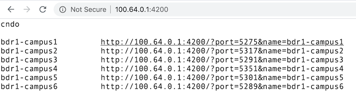

You will need to give students a way to access the consoles on their virtual
routers and switches.

GNS3 provides this by means of telnet on different ports.  It works well,
even allowing multiple sessions to connect to the same port.  Unfortunately,
the port numbers are dynamic, and change each time you start the topology.

The solutions for this are under development and likely to change.

# shellinabox

"shellinabox" allows terminal sessions to take place inside a web browser. 
Install the package:

```
sudo apt-get install shellinabox
```

We have written a front-end which dynamically queries the GNS3 API for the
ports.  Download it and install it:

```
wget https://raw.githubusercontent.com/nsrc-org/nsrc-gns3/master/gns3-shellinabox.py
chmod +x gns3-shellinabox.py
sudo mv gns3-shellinabox.py /usr/local/bin/gns3-shellinabox.py
```

If you have GNS3 http authentication turned on, you will need to set the
username and password within `/usr/local/bin/gns3-shellinabox.py`.

Edit `/etc/default/shellinabox` and change the SHELLINABOX_ARGS setting:

```
SHELLINABOX_ARGS="--no-beep -t -s /:shellinabox:shellinabox:/var/tmp:/usr/local/bin/gns3-shellinabox.py"
```

<!-- (Seems to work acceptably well without this)
Next, create `/etc/systemd/system/shellinabox.service`:

```
[Unit]
Description=shellinabox
After=network-online.target
Wants=network-online.target
Conflicts=shutdown.target

[Service]
Environment=SHELLINABOX_DATADIR=/var/lib/shellinabox
Environment=SHELLINABOX_PORT=4200
Environment=SHELLINABOX_USER=shellinabox
Environment=SHELLINABOX_GROUP=shellinabox
EnvironmentFile=-/etc/default/shellinabox
ExecStart=/usr/bin/shellinaboxd \
    -c ${SHELLINABOX_DATADIR} -p ${SHELLINABOX_PORT} \
    -u ${SHELLINABOX_USER} -g ${SHELLINABOX_GROUP} \
    --user-css "Black on White:+/etc/shellinabox/options-enabled/00+Black on White.css,White On Black:-/etc/shellinabox/options-enabled/00_White On Black.css;Color Terminal:+/etc/shellinabox/options-enabled/01+Color Terminal.css,Monochrome:-/etc/shellinabox/options-enabled/01_Monochrome.css" \
    $SHELLINABOX_ARGS
Restart=on-failure
RestartSec=5

[Install]
WantedBy=multi-user.target
```

Be careful to get uppercase and lowercase exactly correct.

!!! Note
    Although shellinabox comes with an init script, we replace it
    with a systemd service which auto-restarts it on failure.
    This is because it does not always start properly on bootup.

Run `sudo systemctl daemon-reload` to load this file.
-->

Finally, start shellinabox:

```
sudo systemctl start shellinabox
sudo systemctl enable shellinabox
```

Point your web browser at <http://100.64.0.1:4200/> to test.  If the
emulator is running, it should show clickable URLs for each of the console
ports.



Click on one to connect, then hit Enter to wake up the serial port.

## Protecting shellinabox

shellinabox doesn't have a configuration setting to bind to the internal
interface.  Therefore, it will be open and accessible over the Internet if
you have a public IP address on your WAN interface, and you may wish to
firewall it off (e.g. with `iptables` or `ufw`).

<!--
It can be protected using iptables, and a simple way to configure this is
using [ufw](https://help.ubuntu.com/community/UFW):

```
sudo apt-get install ufw
sudo ufw app list
sudo ufw allow OpenSSH
sudo ufw allow from 100.64.0.0/10
sudo ufw allow from 2001:db8::/32
sudo ufw enable
sudo ufw reload
sudo ufw status
```

This leaves SSH (port 22) open to the whole Internet, blocking everything
else except from the local network.

Additional ports can be opened if required, e.g. to allow Netdata to be
visible over the Internet:

```
ufw allow 19999/tcp
```
-->
