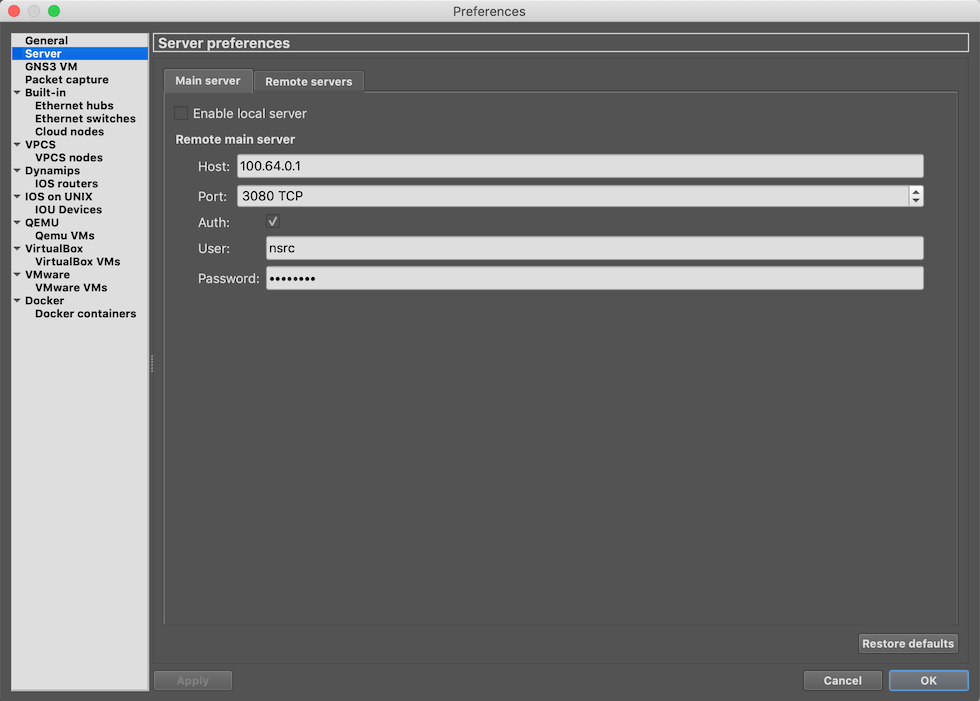

# Install GNS3 client

The front-end for GNS3 is a separate application which you install on your
laptop.  It is available for Windows, macOS and Linux, and you get it
from the [GNS3 download page](https://www.gns3.com/software/download).

You will need to create a GNS3 user account if you don't already have one. 
This account will allow you to participate in the GNS3 forums.

# Configure GNS3 client

Start the GNS3 client on your laptop.

You will need to configure it to use your server.  Select GNS3 Preferences,
and select Server in the left-hand menu.

Uncheck "Enable local server" (that would be if you were running the backend
within a VM on your laptop)

Under "Remote main server" give the IP address 100.64.0.1, TCP port 3080, and
the GNS3 server authentication username and password if you configured them. If
you used the setup script a default one was created for you. Check the settings
in `$HOME/.config/GNS3/2.2/gns3_server.conf` to verify.

At this point, you should now be able to create a test project in GNS3. 
This confirms that communication between the front-end and the back-end is
working.

# GNS3 web interface

GNS3 server also has an experimental web interface: it is available at
<http://100.64.0.1:3080/static/web-ui/bundled>

The functions of this are limited at the moment: it can be used to view the
topology, find out information about nodes, and start and stop them.

However, for now we recommend that you use the GNS3 client for normal
operation.
