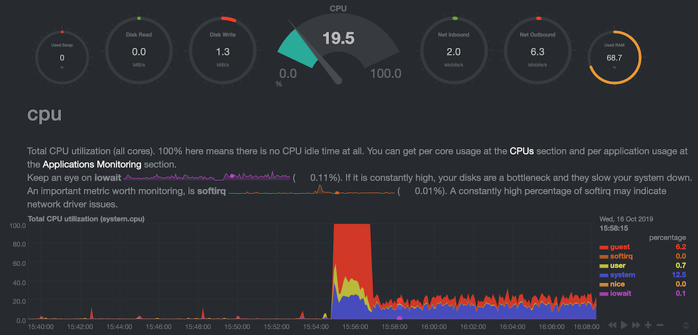

Some additional services are required on the host.

# apt-cacher-ng

All the student VMs are configured to fetch packages via a proxy on
192.168.122.1:3142 - this speeds up downloads drastically when all the class
are fetching the same packages.  Install it:

```
sudo apt-get install apt-cacher-ng
```

We recommend you edit the configuration file `/etc/apt-cacher-ng/acng.conf`
and uncomment/set the following options:

```
ConnectProto: v4

UseWrap: 1
```

The first of these says that even if your machine has picked up an IPv6
address, use IPv4 for outbound connections to package repositories.  Broken
IPv6 networks have been observed as a source of problems before, so this
avoids them.

The second enables "TCP Wrappers" to configure access controls to your proxy
(so that you can block outside parties from abusing your proxy).

To activate these changes:

```
sudo systemctl restart apt-cacher-ng
```

## Securing apt-cacher-ng

To limit which networks can access your proxy, edit `/etc/hosts.allow`:

```
apt-cacher-ng: 127.0.0.1 10.0.0.0/8 192.168.0.0/16 [::1] [2001:db8::]/16
```

and `/etc/hosts.deny`:

```
apt-cacher-ng: ALL
```

!!! Note
    Setting `BindAddress: localhost 192.168.122.1` ought to work too, but is
    not a satisfactory solution because apt-cacher-ng can start before
    libvirt has created the virbr0 network - meaning that it only listens on
    the loopback interface.

## Optional: Fetch via your own proxy

(Otherwise known as "eating your own dogfood")

On your server, create `/etc/apt/apt.conf.d/99proxy` containing:

```
Acquire::http::Proxy "http://192.168.122.1:3142/";
Acquire::https::Proxy "DIRECT";
```

This will make your own server's requests go through its own apt-cacher
proxy, except for https repositories.

Test using `apt-get update`.  Check logs using
`tail /var/log/apt-cacher-ng/apt-cacher.log`

# Optional: netdata

[Netdata](https://github.com/netdata/netdata) lets you monitor the
performance of your platform in real time - CPU usage, RAM usage, disk I/O,
and much more.



(Screenshot shows CPU load while NMM topology starts up and then settles
down into steady state)

To [install](https://github.com/netdata/netdata/tree/master/packaging/installer#linux-64bit-pre-built-static-binary)
or upgrade it, run the following command:

```
bash <(curl -Ss https://my-netdata.io/kickstart-static64.sh)
```

!!!note
    No 'sudo' is required - it will sudo itself when required

Netdata is then visible at <http://192.168.122.1:19999/>
