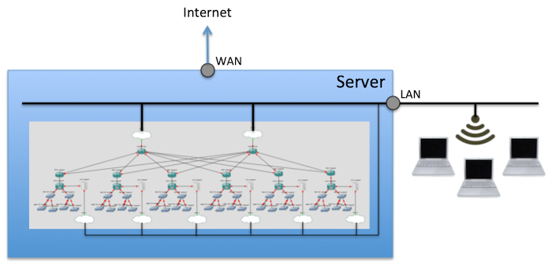

This guide describes how to build and use NSRC's GNS3-based virtual training platform.

# Overview

This is a standalone environment providing "hands-on" lab exercises for a
networking classroom, using virtualized routers, switches and servers
running inside a single physical server.

Different network topologies can be loaded to support the requirements of
different training courses.

The platform integrates with a wired or wireless access network, so students
can directly access and interact with the resources inside the platform. 
The platform is administered by the instructor and can be reset to a
known-good state in preparation for each training course.

# Components

A physical server is required, as described in the [hardware](hardware/)
section.

We recommend that the lab has an external Internet connection, as this will
allow students to access the Internet when connected to the class network.

However, the platform is designed so that if the external Internet connection
is lost, the labs can continue unaffected.  The platform provides local DNS,
DHCP and routing for the class network.

# Licensing

All parts of the training platform are free and open source, with the
exception of the Cisco IOSv and IOSvL2 images.

You can obtain these by purchasing a licence for
[VIRL](http://virl.cisco.com/), which at the time of writing costs $199 per
year.
