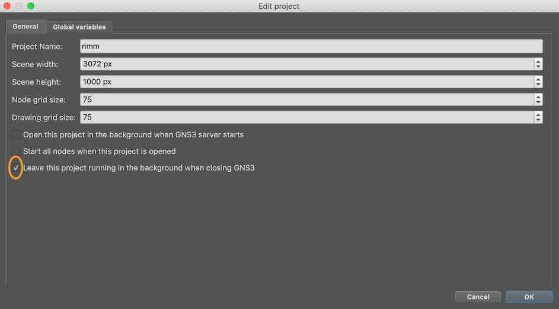
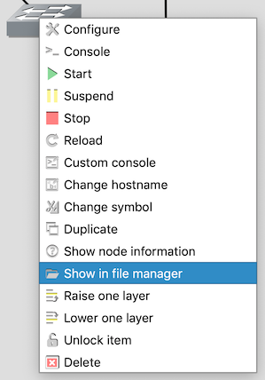
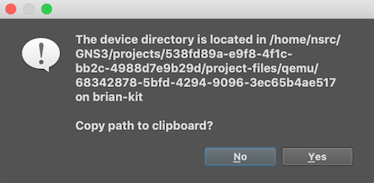

# Leave project running

If for some reason you exit the GNS3 client or it crashes, you do not want
the classroom virtual network to be terminated.  Under `File > Edit Project`
ensure that "Leave this project running in the background when closing"
is checked.  Do this for each topology you use (CNDO, NMM)

# Locked objects

Devices are "locked" in position, so you can't accidentally move them around
or delete them.  Should you wish to do so, then right-click and "Unlock
Item"

# Reset individual device

To reset an individual device to its vanilla, unconfigured state:

* Right-click on a device
* Select "Stop"
* Select "Show in File Manager"

    

* A dialog box will appear, asking if you want to copy the path to the
  clipboard. Say Yes.

    

* Login to your server with ssh, and run the following command:

    `rm <paste>/*.qcow2`

    (for `<paste>` you press whatever button causes the clipboard
    to be pasted into your ssh session)

* Start the device

You are just deleting the qcow2 "differencing" file which contains the
differences between the base image and this device.  A new one is created
automatically.

There is a [feature request](https://github.com/GNS3/gns3-gui/issues/2868)
for a more friendly way to do this - or we could make a script.

# Restore individual device from snapshot

TODO: manual solution

There is a [feature request](https://github.com/GNS3/gns3-gui/issues/2870)
for a more friendly way to do this - or we could make a script.

# Password recovery

GNS3 currently does not have a way to
[export and import IOSv/IOSvL2 configs](https://github.com/GNS3/gns3-server/issues/1315).

TODO: manual solution
