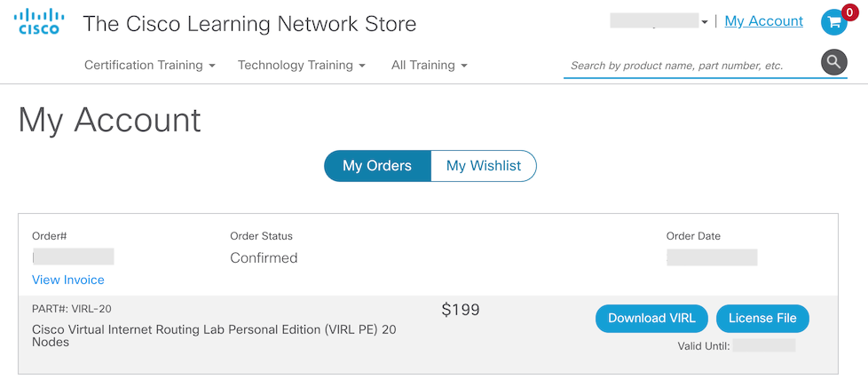
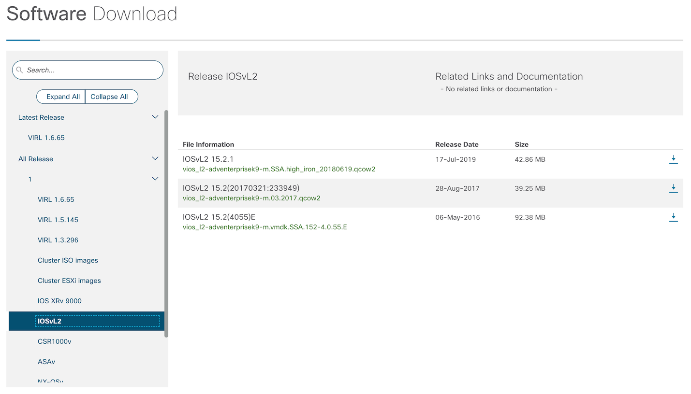

# Operating system

The training platform is based on Ubuntu Server 18.04 LTS, which can be
downloaded from [releases.ubuntu.com](http://releases.ubuntu.com/18.04/).
Additional packages are fetched over the Internet as required.

# GNS3 GUI

The GNS3 GUI is available for Windows, macOS and Linux, and can be
downloaded from the [GNS3 download page](https://www.gns3.com/software/download).

You will need to create a GNS3 user account if you don't already have one.
This account will also allow you to participate in the GNS3 forums.

Sometimes the download page doesn't have the latest version, in which
case use the [github releases page](https://github.com/GNS3/gns3-gui/releases).

# NSRC GNS3 project files

The project files and associated disk images are available from
[NSRC](https://shell.nsrc.org/~vtp/gns3/).

# IOSv / IOSvL2 / CSR1000v

The process for obtaining VIRL images, which requires a paid subscription,
is as follows:

* Go to <http://virl.cisco.com/>
* Click ["Get VIRL"](https://learningnetworkstore.cisco.com/virtual-internet-routing-lab-virl)
  on the top, or "Get Cisco VIRL PE" on bottom right
* If you are not currently logged in, at the top click "login" and go through
  the username and password screens
* At top click "My Account"

    

* Click "Download VIRL" button
* On left navigate to "All Release > 1 > IOSv" or "All Release > 1 > IOSvL2"

    

* Click the download button next to the version you want
