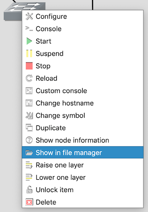
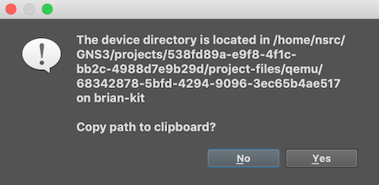

This information may be useful in understanding how the platform works.

# Addressing plan

Since all the labs use the 192.168.122 network for their external
connectivity, there is a common addressing plan on the backbone.

IP address          | DNS name            | Description
:------------------ | :------------------ | :----------
192.168.122.1       | gw.ws.nsrc.org      | The server itself (gateway to the external Internet)
192.168.122.2-4     |                     | Transit routers
192.168.122.5-7     |                     | IXP route servers
192.168.122.8-9     |                     | Reserved for second/third server
192.168.122.10-19   |                     | Group 1 out-of-band management
192.168.122.20-29   |                     | Group 2 out-of-band management
192.168.122.30-39   |                     | Group 3 out-of-band management
192.168.122.40-49   |                     | Group 4 out-of-band management
192.168.122.50-59   |                     | Group 5 out-of-band management
192.168.122.60-69   |                     | Group 6 out-of-band management
192.168.122.70-79   |                     | Group 7 out-of-band management
192.168.122.80-89   |                     | Group 8 out-of-band management
192.168.122.100-249 |                     | DHCP (student laptops)
192.168.122.250     | noc.ws.nsrc.org     | NOC VM
192.168.122.251     | ap1.ws.nsrc.org     | Wireless access point
192.168.122.252     | ap2.ws.nsrc.org     | Wireless access point
192.168.122.253     | sw.ws.nsrc.org      | Switch
192.168.122.254     |                     | Target for inbound static route

Some topologies use the same address space - in particular, CNDO and NMM use
the same backbone addresses for transit routers and out-of-band management. 
This means that if you start both these topologies at the same time, it
won't work.

IPv6 on the backbone uses `2001:DB8:0:0::/64` (e.g. for the transit routers
to talk to each other, and for IPv6 to/from the NOC).  It also uses
link-local addresses for router next hop, specifically `fe80::1` for the
server and `fe80::254` for the inbound static route.

Inside the labs, address space is taken from `100.64.0.0/10`.  This "looks
like" public IP space, but is actually reserved space from
[RFC 6598](https://tools.ietf.org/html/rfc6598).

# Out-of-band management

The student VMs (srv1/hostN) are connected both to the IOSv/IOSvL2 campus
network and the 192.168.122 network.  Their default gateway points via the
virtual campus network, but the 192.168.122 connection functions as an
"out-of-band management" network.

When students connect to their VM on its 192.168.122 address, it bypasses
the IOSv network.  This is important because IOSv has a throughput limit of
only 2Mbps (250KB/sec); it also minimises the load on the emulation.

Out-of-band management also means their VMs are accessible even when the
virtual campus network is broken.  This can be useful - for example they can
break the campus network and still get into Nagios to see everything turn
red.

The student machines are configured to fetch packages via 192.168.122.1 as a
proxy (see `/etc/apt/apt.conf.d/99proxy`).  This means that installing
packages is also not throttled by IOSv, and reduces external bandwidth
because of apt-cacher-ng.

# IPv6

IPv6 uses `2001:db8::/32`, the documentation prefix, and works internally
between the nodes in the emulation.  Some topologies also use `2001:10::/28`
which comes out of the reserved prefix `2001::/23`.

You do not require any external IPv6 connectivity to your server to be able
to use IPv6 in the exercises.

If your server *does* have an IPv6 address on its WAN interface, then
outbound IPv6 traffic from the emulation will NAT to this address.  This
means that `ping6` and `traceroute6` to the Internet will work as expected.

The `srv1` VM has a customised `/etc/gai.conf` which prefers IPv4 over IPv6,
except when talking to another `2001:db8::` address.  This reduces the risk
of timeouts when talking to a machine on the public Internet which
advertises a AAAA record, but when no IPv6 connectivity is available.

The classroom wifi network intentionally does not have any IPv6, apart from
link-local addresses, so as not to interfere with student Internet access.
If you do want to deploy IPv6 on the classroom wifi, see
[unusual configurations](../unusual-configurations/#ipv6-on-class-network).

# Cloud-init

The Ubuntu VMs (such as srv1 in the CNDO and NMM topologies) have two
virtual disks attached.

The first is the VM image itself, which can be quite large, but is shared by
all instances of the VM.

The second is a small MSDOS image containing "cloud-init" files.  This is
read when the VM first boots, and is responsible for configuring the VM's
static IP address and creating the default username and password (which are
not hard-coded in the image itself).

When the VM appears multiple times in the same topology, this means a
separate cloud-init image is needed for each instance to come up on the
correct IP address.

When logged into the srv1 VM, you can examine its cloud-init configuration:

```
sudo mount -r /dev/vdb /mnt
ls /mnt
cat /mnt/network-config
cat /mnt/user-data
```

# lxd containers

lxd is a lightweight virtualization technology, which allows host1-6 to
exist in the NMM topology with minimal extra resource requirements.  All the
containers share the same underlying kernel and filesystem.

The fact that host1-6 are lxd containers is an implementation detail. 
However, if you login to srv1, you can see and manage the containers using
the `lxc` command-line tool:

```
sysadm@srv1:~$ lxc list
+-------------+---------+-----------------------+----------------------------------------+------------+-----------+
|    NAME     |  STATE  |         IPV4          |                  IPV6                  |    TYPE    | SNAPSHOTS |
+-------------+---------+-----------------------+----------------------------------------+------------+-----------+
| gold-master | STOPPED |                       |                                        | PERSISTENT | 0         |
+-------------+---------+-----------------------+----------------------------------------+------------+-----------+
| host-master | STOPPED |                       |                                        | PERSISTENT | 0         |
+-------------+---------+-----------------------+----------------------------------------+------------+-----------+
| host1       | RUNNING | 192.168.122.11 (eth1) | 2001:db8:1:1::131 (eth0)               | PERSISTENT | 0         |
|             |         | 100.68.1.131 (eth0)   | 2001:db8:1:1:216:3eff:fed8:988e (eth0) |            |           |
+-------------+---------+-----------------------+----------------------------------------+------------+-----------+
| host2       | RUNNING | 192.168.122.12 (eth1) | 2001:db8:1:1::132 (eth0)               | PERSISTENT | 0         |
|             |         | 100.68.1.132 (eth0)   | 2001:db8:1:1:216:3eff:fef0:c02a (eth0) |            |           |
+-------------+---------+-----------------------+----------------------------------------+------------+-----------+
| host3       | RUNNING | 192.168.122.13 (eth1) | 2001:db8:1:1::133 (eth0)               | PERSISTENT | 0         |
|             |         | 100.68.1.133 (eth0)   | 2001:db8:1:1:216:3eff:feec:66e (eth0)  |            |           |
+-------------+---------+-----------------------+----------------------------------------+------------+-----------+
| host4       | RUNNING | 192.168.122.14 (eth1) | 2001:db8:1:1::134 (eth0)               | PERSISTENT | 0         |
|             |         | 100.68.1.134 (eth0)   | 2001:db8:1:1:216:3eff:fe7c:8e93 (eth0) |            |           |
+-------------+---------+-----------------------+----------------------------------------+------------+-----------+
| host5       | RUNNING | 192.168.122.15 (eth1) | 2001:db8:1:1::135 (eth0)               | PERSISTENT | 0         |
|             |         | 100.68.1.135 (eth0)   | 2001:db8:1:1:216:3eff:fe33:e459 (eth0) |            |           |
+-------------+---------+-----------------------+----------------------------------------+------------+-----------+
| host6       | RUNNING | 192.168.122.16 (eth1) | 2001:db8:1:1::136 (eth0)               | PERSISTENT | 0         |
|             |         | 100.68.1.136 (eth0)   | 2001:db8:1:1:216:3eff:fe37:687 (eth0)  |            |           |
+-------------+---------+-----------------------+----------------------------------------+------------+-----------+
```

This can be useful.  For example, if a student has broken the password in
one of the hostX containers, you can login to srv1, get a root shell inside
the container, and reset the password.

```
$ lxc exec host1 bash
# passwd sysadm
# exit
```

The "gold-master" and "host-master" are pre-built lxd images which are
cloned to create host1-6 when the VM first starts up (controlled by
cloud-init).  You should not start these.

The filesystem in the VM is btrfs.  This allows the host containers to be
launched as zero-copy clones, and also allows de-duplication of blocks
between the VM Ubuntu image and the container Ubuntu image.

The containers are also configured using cloud-init.  You can see the
cloud-init data passed in from the outer VM:

```
lxc config get host1 user.network-config
lxc config get host1 user.user-data
```

# Kernel Samepage Merging

When you have many similar VMs running, [Kernel Samepage
Merging](https://www.linux-kvm.org/page/KSM) can save RAM by identifying
identical pages and keeping only one copy.

This feature should be enabled automatically - if you want to check, the
configuration is in `/etc/default/qemu-kvm`

Once you have GNS3 up and running, you can check whether KSM is working by
seeing how many pages are shared:

```
$ cat /sys/kernel/mm/ksm/pages_sharing
53997
```

Multiply by 4 to get an estimate (in KB) of the amount of RAM being saved by
KSM.

# GNS3 manual configuration management

The `gns3man` tool performs direct manipulation of the qemu image state for
individual devices.  For reference, here is how these tasks can be done
manually.

## Reset individual device

To reset an individual device to its vanilla, unconfigured state:

* Right-click on a device
* Select "Stop"
* Select "Show in File Manager"

    

* A dialog box will appear, asking if you want to copy the path to the
  clipboard. Say Yes.

    

* Login to your server with ssh, and run the following command:

    `rm <paste>/*.qcow2`

    (for `<paste>` you press whatever button causes the clipboard
    to be pasted into your ssh session)

* Start the device

You are just deleting the qcow2 "differencing" file which contains the
differences between the base image and this device.  A new one is created
automatically.

## Restore individual device from snapshot

This is rather difficult to do manually.

* Right-click on a device
* Select "Stop"
* Select "Show in File Manager"
* Paste it somewhere.  It will look something like this:

```
/home/nsrc/GNS3/projects/538fd89a-e9f8-4f1c-bb2c-4988d7e9b29d/project-files/qemu/a1b1bac7-24d3-414c-88dd-09de24bb0204
<-------------------- project path -------------------------> <-------------- node relative path ------------------->
```

```
$ cd <project-path>
$ ls snapshots
# Pick the one you want, e.g. ssh-snmp_101019_165326.gns3project
$ unzip -v snapshots/ssh-snmp_101019_165326.gns3project
```

This shows you the nodes in the snapshot.  Unfortunately they have different
UUIDs than the ones on your system :-(

So now you unpack the 'project.gns3' file within the snapshot, and look for
the node ID of the device you want to retrieve:

```
$ unzip -d /tmp snapshots/ssh-snmp_101019_165326.gns3project project.gns3
$ grep -1 core1-campus1 /tmp/project.gns3
                    "style": "font-family: TypeWriter;font-size: 10.0;font-weight: bold;fill: #000000;fill-opacity: 1.0;",
                    "text": "core1-campus1",
                    "x": -19,
--
                "locked": true,
                "name": "core1-campus1",
                "node_id": "7c894529-2ba3-432f-8fd6-ab7d5b471c3b",
```

Now you need to extract that node, but put it in the right place.

```
$ unzip -j snapshots/ssh-snmp_101019_165326.gns3project -d project-files/qemu/a1b1bac7-24d3-414c-88dd-09de24bb0204 \
                                                           <-------------- node relative path ------------------->
    'project-files/qemu/7c894529-2ba3-432f-8fd6-ab7d5b471c3b/*.qcow2'
                        <------- snapshot node ID  -------->
```

## Password recovery

GNS3 currently does not have a way to
[export and import IOSv/IOSvL2 configs](https://github.com/GNS3/gns3-server/issues/1315).

It can be done manually, using guestfish to extract the nvram file and a
script to convert it to text.  The steps are outlined here - they are the
same for IOSv and IOSvL2.  You will need to install package
`libguestfs-tools`.

* STOP THE DEVICE.  This is important!
* Use "Show in file manager", and cd to the node directory
* Optional: examine the disk image using guestfish

```shell
virt-ls -l -a hda_disk.qcow2 -m /dev/sda1:/ /
```

* Extract and convert nvram file

```shell
virt-cat -a hda_disk.qcow2 -m /dev/sda1:/ /nvram >/tmp/nvram
PYTHONPATH=$(echo /usr/share/gns3/gns3-server/lib/*/site-packages) python3 \
    -m gns3server.compute.iou.utils.iou_export /tmp/nvram /tmp/config /tmp/private
```

This gives you the text config in `/tmp/config`. Edit it, e.g. to
change the password or enable secret.

Now you have to reverse the process to convert back to NVRAM and upload
into the disk image:

```shell
PYTHONPATH=$(echo /usr/share/gns3/gns3-server/lib/*/site-packages) python3 \
    -m gns3server.compute.iou.utils.iou_import -c 512 /tmp/nvram /tmp/config /tmp/private
guestfish -a hda_disk.qcow2 -m /dev/sda1:/ -- upload /tmp/nvram /nvram
```

After this you can start the device again.

## libguestfs error

If you see the following error:

```
libguestfs: error: /usr/bin/supermin exited with error status 1.
```

then this is just a permissions problem which can be fixed by:

```
sudo chmod +r /boot/vmlinuz-*
```

(This has to be re-done each time you upgrade the kernel on your server)

# Issues outstanding with GNS3

Some of these are being tracked on github.

* [Importing project does not prompt to import image files](https://github.com/GNS3/gns3-gui/issues/2881)
* ~~[GUI shows permission error when restoring from snapshot](https://github.com/GNS3/gns3-gui/issues/2871)~~
* [UI for stopping/starting selected devices](https://github.com/GNS3/gns3-gui/issues/2876)
* [Release notes for GNS 2.2 not yet available](https://community.gns3.com/community/discussion/gns3-2-2-release-notes)
* ~~["host" setting does not bind console ports](https://github.com/GNS3/gns3-server/issues/1667)~~
* [Dual stack support](https://github.com/GNS3/gns3-server/issues/1673)
* [Export/import configs for IOSv](https://github.com/GNS3/gns3-server/issues/1315)
  ([discussion](https://www.gns3.com/qa/how-to-import-configs-for-iosv-i))
* [Restore individual devices from snapshot](https://github.com/GNS3/gns3-gui/issues/2870)
* [Reset individual devices to initial state](https://github.com/GNS3/gns3-gui/issues/2868)
* [Assigning fixed port numbers for consoles](https://github.com/GNS3/gns3-gui/issues/2811)
  ([discussion](https://community.gns3.com/community/discussion/possible-to-assign-fixed-tcp-por))
* [Websockets console access](https://github.com/GNS3/gns3-gui/issues/2883)
* [GUI: Bend links](https://github.com/GNS3/gns3-gui/issues/2303)
* [GUI: Duplicating multiple selected objects](https://github.com/GNS3/gns3-gui/issues/2966)
