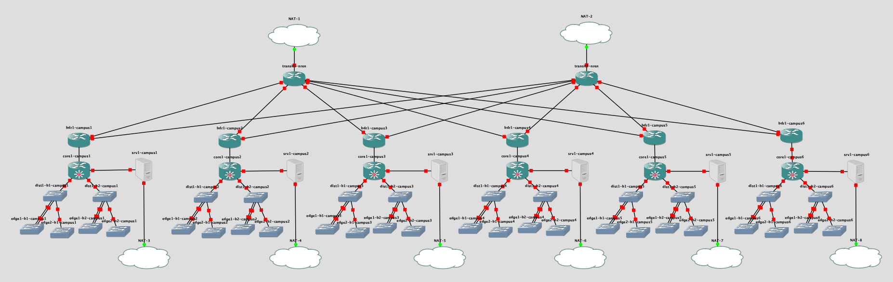
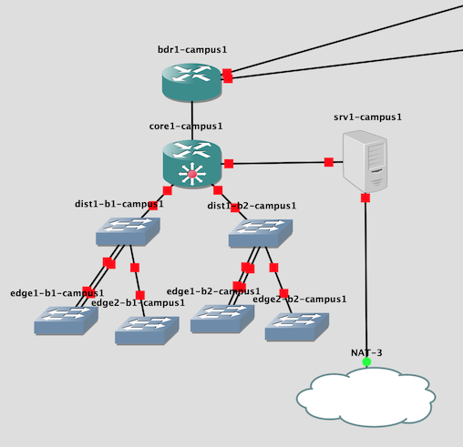

# Campus Network Design and Operations (CNDO)

The goal of the Campus Network Design and Operations course is to teach
configuration of switching (layer 2) and routing (layer 3) according to
campus best practices.

The CNDO lab topology contains six virtual campuses, so the class is
expected to be divided into six groups.

Each campus has:

* A border router (bdr1)
* A core switch/router (core1)
* Two building distribution switches (dist1-b1/b2)
* Four edge switches (edge1/2-b1/2)
* A server (srv1)

In addition, there are two "transit" routers which provide the uplinks to
the campus: transit1-nren and transit2-nren.  The second is currently not
used, but exists in case you wish to make some simple multi-homing
exercises.

# Files

You will need the following files:

File | Description
:--- | :----------
`hosts-cndo-nmm` | `/etc/hosts` file to go on the server
`cndo-<version>.gns3project` | the GNS3 project
`vios-adventerprisek9-m.vmdk.SPA.157-3.M3` | IOSv image
`vios_l2-adventerprisek9-m.SSA.high_iron_20180619.qcow2` | IOSvL2 image
`ubuntu-16.04-server-cloudimg-amd64-disk1-20191002.1.img` | Ubuntu Cloud image
`cndo-srv1-campus<N>-hdb-<version>.img` (x 6) | cloud-init configs for srv1 in each campus

# Device software

The border routers and the NREN transit routers run IOSv with 384MB RAM. 
The remaining switches run IOSvL2 with 512MB RAM.

Note that IOSvL2 currently does not support OSPFv3, so the exercises are
now using IS-IS instead.

srv1 is a completely vanilla Ubuntu Cloud image, with no extra software
installed, and configured to use 512MB of RAM.  It may be useful as a
ping/traceroute endpoint, or for simple Linux exercises.

The total memory allocation of all the devices is 27GB.  You can save a
little RAM by turning off transit2-nren.  There should still be enough RAM
to run the NOC.

# Backbone addressing plan

IP Address      | DNS Name
:-------------- | :---------------------------
100.64.0.2   | transit1-nren.ws.nsrc.org
100.64.0.3   | transit2-nren.ws.nsrc.org
100.64.0.10  | srv1.campus1.ws.nsrc.org
100.64.0.20  | srv1.campus2.ws.nsrc.org
100.64.0.30  | srv1.campus3.ws.nsrc.org
100.64.0.40  | srv1.campus4.ws.nsrc.org
100.64.0.50  | srv1.campus5.ws.nsrc.org
100.64.0.60  | srv1.campus6.ws.nsrc.org
100.64.0.254 | transit-nren.ws.nsrc.org (on transit1-nren)

See the training materials for the addressing plan used inside the network.

# Credentials

The student routers have username `cndlab`, password `lab-PW`, enable `lab-EN`
(except in the initial state "l2-0-blank", when they are unconfigured)

The transit routers have username `nsrc`, password `lab-PW`, enable
`lab-EN`.

The srv1 Ubuntu servers are initialized with username `sysadm`, password
`nsrc+ws`

# Snapshots

There are pre-generated snapshots for many different stages of the lab. 
These may be useful if you want to draw a session to a close and force all
configs onto a known good working state.  Snapshots are named `l2-*` for
earlier (layer 2) exercises, and `l3-*` for the later (layer 3) exercises.

Normally a CNDO class starts with the routers and switches completely
unconfigured.  You can reset to this state using the "l2-0-blank" snapshot
(note that the NREN transit routers *are* configured in this snapshot)

You can restore to any given snapshot using `Edit > Manage Snapshots` in the
GNS3 client.  Beware that when you restore from a snapshot it will reset
*all* of the devices - including the Linux servers - and you will also lose
any changes you've made to the network topology itself.  This is useful if
you've accidentally deleted a device!

Use the `gns3man` tool if you want to restore the configuration of an
individual device.
