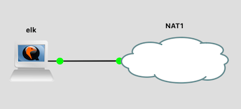

# Elasticsearch / Logstash / Kibana (ELK)

This is another single-VM topology, containing the OSS (Apache2-licensed)
version of the Elastic Stack, ready to install ElastiFlow for visualization
of Netflow data.

These are heavyweight tools, and it's expected that you'll only run a single
shared instance of them for the whole workshop.  The students can all access
the same web interface for exploring data.

# Topology

This consists of a single virtual machine, elk.ws.nsrc.org
(192.168.122.249).  The VM has been configured with 8GB of RAM.



# Files

You will need the following files:

File | Description
:--- | :----------
`elk-<version>.gns3project` | the GNS3 project
`nsrc-elk-<version>.qcow2` | the VM image with tools pre-installed (large download: ~1.2GB)
`elk-hdb-<version>.img` | the cloud-init image which configures username/password and static IP

# IP addresses

IP Address      | DNS Name
:-------------- | :---------------------------
192.168.122.249 | elk.ws.nsrc.org, kibana.ws.nsrc.org
2001:db8::249   | elk.ws.nsrc.org, kibana.ws.nsrc.org

# Credentials

* ssh login: `sysadm` and `nsrc+ws` (the standard student login).  It's up
  to you whether you wish to keep this or change it.

* The Kibana dashboard is available at <http://kibana.ws.nsrc.org> (no
  login).  This is a virtualhost, to allow other tools to be added as
  further virtualhosts later if required.

# Software installation

## ElastiFlow

ElastiFlow has a [custom license](http://www.koiossian.com/public/robert_cowart_public_license.txt)
which permits non-commercial use, but forbids redistribution, so it cannot be
supplied in the pre-built VM.

Login to the VM, and then run the following script to download ElastiFlow
and perform all the standard configuration:

```
sudo /usr/local/libexec/elastiflow-setup.sh
```

This takes around 4 minutes to run, and then another 2-3 minutes for
logstash to finish restarting before it can start processing flow data.

You will see the following warnings appear several times, but they can be
[ignored](https://github.com/jruby/jruby/issues/6049):

```
OpenJDK 64-Bit Server VM warning: Option UseConcMarkSweepGC was deprecated in version 9.0 and will likely be removed in a future release.
WARNING: An illegal reflective access operation has occurred
WARNING: Illegal reflective access by com.headius.backport9.modules.Modules to method sun.nio.ch.NativeThread.signal(long)
WARNING: Please consider reporting this to the maintainers of com.headius.backport9.modules.Modules
WARNING: Use --illegal-access=warn to enable warnings of further illegal reflective access operations
WARNING: All illegal access operations will be denied in a future release
```

## Filebeat

Although Filebeat (OSS) is already installed, we provide a setup script for
it as well:

```
sudo /usr/local/libexec/filebeat-setup.sh
```

This sets up the "system" module to read local logs from (`/var/log/syslog`)
and also configures rsyslog to receive UDP port 514, so that you can use it
as a target for logs from other hosts.

# Configuration

ElastiFlow lists on IPv4 UDP port 2055 for Netflow traffic.

If you're running softflowd on the host, then you can change it to send
traffic to Elastiflow instead of nfdump/nfsen by changing
`/etc/default/softflowd` to

```
OPTIONS="-n 192.168.122.249:2055 -v 9 -t maxlife=5m"
```

ElastiFlow does not listen by default on IPv6 addresses, but it can be
[configured](https://github.com/robcowart/elastiflow/blob/master/INSTALL.md#6-configure-inputs)
to do so.

Alternatively, you might want to configure one or more virtual Cisco routers
(e.g. `transit1.nren` / `transit2.nren`) to generate flow records including
NBAR application recognition, as Elastiflow will record this as
`flow.application`.

Here is a suggested configuration to apply:

```
flow record NBAR-V4
 match application name
 match ipv4 tos
 match ipv4 protocol
 match ipv4 source address
 match ipv4 destination address
 match transport source-port
 match transport destination-port
 collect interface input
 collect interface output
 collect counter bytes long
 collect counter packets long
!
flow record NBAR-V6
 match application name
 match ipv6 traffic-class
 match ipv6 protocol
 match ipv4 source address
 match ipv4 destination address
 match transport source-port
 match transport destination-port
 collect interface input
 collect interface output
 collect counter bytes long
 collect counter packets long
!
flow exporter EXPORTER-ELK
 description Export to elk
 destination 192.168.122.249
 transport udp 2055
 template data timeout 60
!
flow monitor FLOW-MONITOR-V4
 exporter EXPORTER-ELK
 cache timeout active 300
 record NBAR-V4
!
flow monitor FLOW-MONITOR-V6
 exporter EXPORTER-ELK
 cache timeout active 300
 record NBAR-V6
!
interface GigabitEthernet 0/0
 ip flow monitor FLOW-MONITOR-V4 input
 ip flow monitor FLOW-MONITOR-V4 output
 ipv6 flow monitor FLOW-MONITOR-V6 input
 ipv6 flow monitor FLOW-MONITOR-V6 output
```

The mapping from NBAR IDs to application names is in
[`/opt/elastiflow/logstash/elastiflow/dictionaries/app_id.yml`](https://github.com/robcowart/elastiflow/blob/master/logstash/elastiflow/dictionaries/app_id.yml)

# Disable auto-close

ELK is slow to start up, particularly Logstash: once it's running, you'll
want to keep it running.  Make sure you select "Leave this project running
in the background when closing GNS3" under `File > Edit Project` in the GNS3
client.
