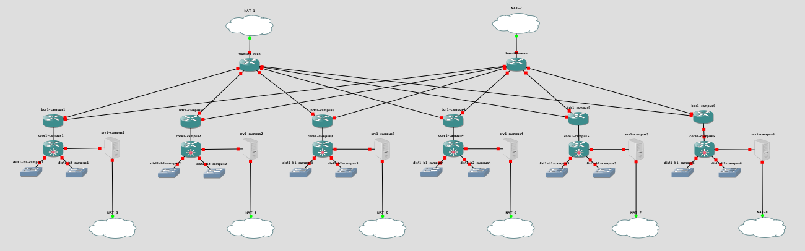
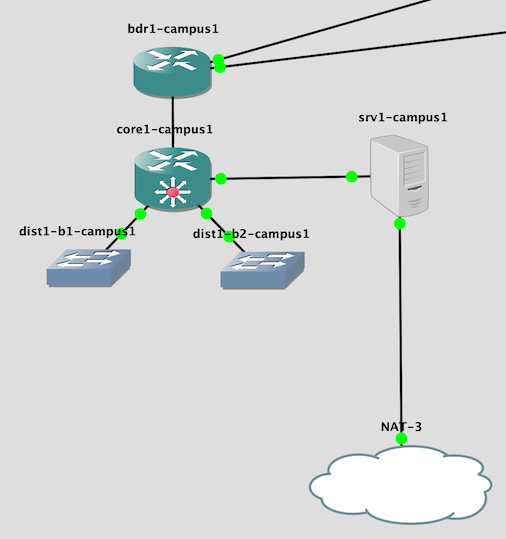
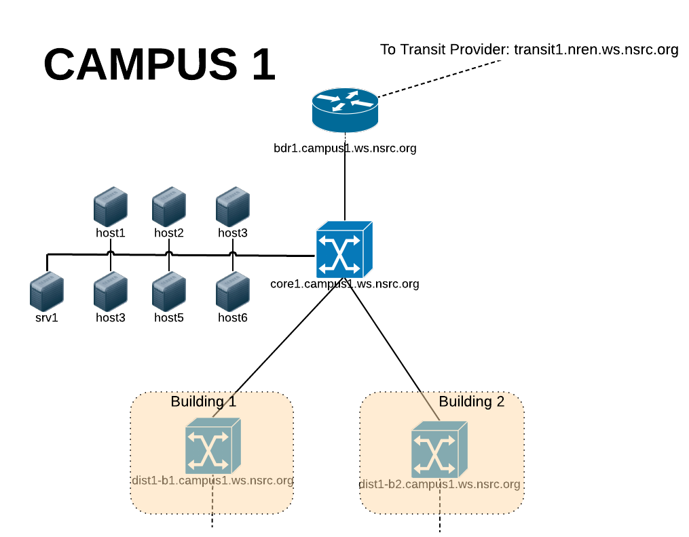

# Network Monitoring and Management (NMM)

This course teaches the principles of Network Monitoring and Management,
illustrated by a variety of open-source tools which students themselves
configure and use.

The NMM lab is a trimmed version of the [CNDO](../cndo/) topology.

The building edge switches are removed, and instead each srv1 host has 2.5GB
RAM, sufficient to run multiple NMM tools.  The total memory usage is again 27GB.

The core and distribution switches are configured with 4 interfaces, as
opposed to 16 in CNDO.  This reduces the amount of work for LibreNMS to do.

# Files

You will need the following files:

File | Description
:--- | :----------
`nmm-<version>.gns3project` | the GNS3 project
`vios-adventerprisek9-m.vmdk.SPA.157-3.M3` | IOSv image - same as CNDO
`vios_l2-adventerprisek9-m.SSA.high_iron_20180619.qcow2` | IOSvL2 image - same as CNDO
`nsrc-nmm-<version>.qcow2` | the VM image with NMM tools pre-installed - same as NOC
`nmm-srv1-campus<N>-hdb-<version>.img` (x 6) | cloud-init configs for srv1 in each campus

# lxd containers

Each srv1 virtual machine starts 6 lxd containers inside it, called
host1-host6.  From the students' point of view, they see 7 virtual machines
in their campus: srv1 and host1-6.

But inside GNS3, there is only srv1.  Stopping this will also stop host1-6.

Each of the "host" containers has a set of the smaller NMM tools
preinstalled:

* nagios
* snmp / snmpd
* smokeping
* rsyslog
* swatch

This means that for exercises using these tools, you have 36 instances to
play with, and each student can work on their own instance.

The top-level VM (srv1) contains the larger and more resource-intensive
tools:

* LibreNMS
* cacti
* nfsen
* RT
* rancid
* mysql (used by LibreNMS, cacti and RT)

This means that for exercises using these tools, students will have to work
in their campus groups.

# Backbone addressing plan

All the containers have out-of-band interfaces, so that students' ssh and
web traffic does not need to traverse the emulated network.

IP Address      | DNS Name
:-------------- | :---------------------------
192.168.122.2   | transit1-nren.ws.nsrc.org
192.168.122.3   | transit2-nren.ws.nsrc.org
192.168.122.10  | srv1.campus1.ws.nsrc.org
192.168.122.11  | host1.campus1.ws.nsrc.org
192.168.122.12  | host2.campus1.ws.nsrc.org
192.168.122.13  | host3.campus1.ws.nsrc.org
192.168.122.14  | host4.campus1.ws.nsrc.org
192.168.122.15  | host5.campus1.ws.nsrc.org
192.168.122.16  | host6.campus1.ws.nsrc.org
192.168.122.2x  | (ditto for campus2)
192.168.122.3x  | (ditto for campus3)
192.168.122.4x  | (ditto for campus4)
192.168.122.5x  | (ditto for campus5)
192.168.122.6x  | (ditto for campus6)
192.168.122.254 | transit-nren.ws.nsrc.org (on transit1-nren)

See the training materials for the addressing plan used inside the network.

# Credentials

The student routers have username `nmmlab`, password `lab-PW`, enable
`lab-EN`.

The transit routers have username `nsrc`, password `lab-PW`, enable
`lab-EN`.

srv1 and host1-6 ssh login is `sysadm` with password `nsrc+ws`.

Monitoring tool credentials are as per the [NOC](../noc/#credentials) topology -
it's the same VM image.

# Snapshots

There is a smaller set of snapshots provided.

* `default` is the initial state.  All routing is configured and the devices
  have usernames/passwords set, but ssh is not enabled.
* `ssh` is a snapshot where ssh has been enabled and telnet disabled. Note
  however that you will need to login to each device and do
  `crypto key generate rsa modulus 2048`, as this key is not stored within
  the config.
* `ssh-snmp` is similar, but snmp has also been configured.
* There is no snapshot with netflow configured (yet)

Beware that resetting to any of these snapshots will also reset all srv1 and
host1-6 to their default states - any work that students have done will be
erased!  Therefore you almost certainly only want to do this once, before the
course starts.
