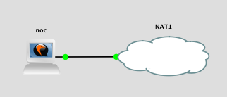
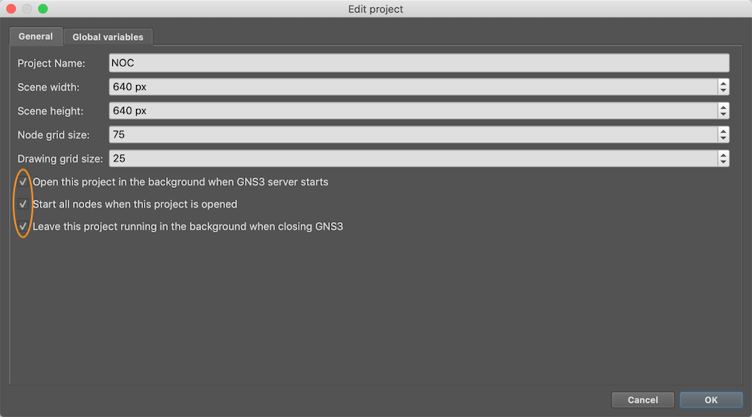

# Network Operations Centre (NOC)

The NOC is the simplest topology, and we recommend you start with this to get
familiar with the platform.

Its purpose is to be able to demonstrate the Network Monitoring and
Management tools to the class, populated with real data.  It can become a
long-term store of monitoring data collected over months and years, giving a
more meaningful collection of data to show than the data the students
themselves collect over a few days.

It's also helpful for you, the instructor, to practice configuring these
tools.

# Topology

NOC consists of a single virtual machine, noc.ws.nsrc.org (192.168.122.250). 
It runs the same VM image as the NMM training course.



The NAT "cloud" represents the connection to the `virbr0` bridge.

The GNS3 project configures the NOC VM to have 2.5GB RAM.  It should be
possible to run this project on a machine with as little as 4GB.

# Files

You will need the following files:

File | Description
:--- | :----------
`noc-<version>.gns3project` | the GNS3 project
`nsrc-nmm-<version>.qcow2` | the VM image with NMM tools pre-installed (large download: ~2GB)
`noc-hdb-<version>.img` | the cloud-init image which configures username/password and static IP

Note that this topology does *not* use the Cisco IOSv or IOSvL2 images. 
This means that it is completely free to use, and can be freely
shared.

# Credentials

* ssh login: `sysadm` and `nsrc+ws` (the standard student login).  It's up to
  you whether you wish to keep this or change it.  One the one hand, you
  might want students to be able to login and look around; on the other
  hand, you might want to protect it from being damaged by students.
* nagios login: `nagiosadmin` and `nsrc+ws`
* LibreNMS login: <http://librenms.ws.nsrc.org/>, `admin` and `nsrc+ws`
* RT login: `root` and `nsrc+ws`
* mysql root password: `nsrc+ws`

# Configuration

The NMM tools are in an unconfigured state.  You can configure them
following the NMM lab exercises, but ultimately how you configure them is up
to you.  You could:

* Monitor the classroom hardware (access point, switch)
* Monitor external resources (e.g. smokeping DNS test to 8.8.8.8)
* Monitor the labs, e.g. Nagios checks of bdr1 and core1 in each campus, so
  you can visualise how the class is progressing.  Note that you won't be
  able to directly reach the dist and edge switches in CNDO, as they are
  behind NAT.
* Collect configs from transit1-nren and transit2-nren (192.168.122.2 and .3)
  using rancid
* Generate graphs of classroom bandwidth usage - SNMP monitoring of
  192.168.122.1 in LibreNMS
* Collect classroom netflow data in nfsen.  This can be extremely interesting
  to see which students are running torrents!

You should also install a HTML page at `/var/www/html/index.html` which links
to all the tools.  You can use [this sample](noc-index.html) as a base.

# LibreNMS fixes

(Should be fixed in a future release)

To make the LibreNMS URL work, you will need to login to the NOC VM (`ssh
sysadm@noc.ws.nsrc.org` if you are on the class network with DNS setup, or
`ssh sysadm@192.168.122.250` otherwise)

Edit `/etc/apache2/sites-available/librenms.conf` and change

```
  ServerAlias librenms.*.ws.nsrc.org
```

to

```
  ServerAlias librenms.*
```

followed by `sudo systemctl reload apache2`

Next: for some reason php7.2 and php7.3 are both installed; apache is using
7.2 but the cronjobs are using 7.3, which means that discovery doesn't work. 
To fix:

```shell
sudo update-alternatives --set php /usr/bin/php7.2
```

# snmpd

To allow your physical host to be monitored by LibreNMS, install
and configure snmpd.

```
sudo apt-get install snmpd
```

Refer to the snmp labs in the NMM workshop for how to configure an SNMPv2c
community string and SNMPv3 authentication.  Ensure that the ACL allows
access from `192.168.122.0/24`.

Then return to the LibreNMS web interface and add "gw.ws.nsrc.org" as a
device.  It will take up to 5 minutes for it to be discovered.

# softflowd

To generate netflow data for traffic going in and out of the class, login to
your physical server (not the NOC VM!) and install softflowd.

```
sudo apt-get install softflowd
```

Edit `/etc/default/softflowd`

```
INTERFACE="virbr0"

OPTIONS="-n 192.168.122.250:9996 -v 9 -t maxlife=5m"
```

Restart after the change:

```
sudo systemctl restart softflowd
sudo systemctl enable softflowd
```

Then, login to the NOC VM.  You will need to start nfsen there, just like
the students would have had to:

```
sudo update-rc.d nfsen defaults 20
sudo service nfsen start
```

Data will become visible at <http://noc.ws.nsrc.org/nfsen/nfsen.php>

TODO: You may find that softflowd does not start automatically when the
machine is rebooted, and `systemctl status softflowd` says that `virbr0`
does not exist.

If so, you can start it by hand using `systemctl restart softflowd`.

Long-term fix will be to create a systemd unit file or network hook so that
softflowd is started *after* libvirt has created virbr0.

# Auto-start

Since the NOC is a separate topology, you can keep your NOC running even
when you shutdown or wipe your teaching topologies.  This is what allows it
to continue to collect data over the long term.

To make this even more useful, you can arrange that:

* The NOC project is opened automatically whenever the GNS3 server starts
* The NOC VM is started automatically when the NOC project is opened
* The NOC project continues running in the background even when you close
  the GNS3 client

These options are available under `File > Edit Project` in the GNS3 client.



