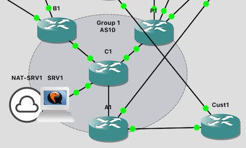
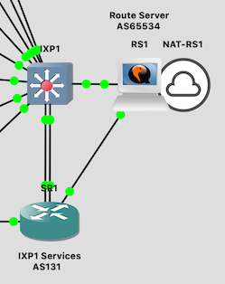

# Peering/IXP

This is a technical workshop to teach the Interior Gateway Protocol (IGP)
and Border Gateway Protocol (BGP) skills required for configuring
interconnections between the autonomous networks that make up the Internet
according to current industry best practices.

It runs with up to 8 groups.  Each group has:

* A border router (BX)
* A peering router (PX)
* A core router (CX)
* An access router (AX)
* A customer router (CustX)
* A server (srvX)

In addition, there are two "transit" routers which provide the uplinks; and
two IXPs each with a switch (IXP), a services router (SR), and an Ubuntu
BIRD router server (RS).

# Files

You will need the following files:

File | Description
:--- | :----------
`hosts-peering-ixp` | `/etc/hosts` file to go on the server
`peering-ixp-<version>.gns3project` | the GNS3 project
`vios-adventerprisek9-m.vmdk.SPA.157-3.M3` | IOSv image
`vios_l2-adventerprisek9-m.SSA.high_iron_20180619.qcow2` | IOSvL2 image
`nsrc-rs-<version>.qcow2` | VM image with bird preinstalled, for RS and SRV instances
`peering-ixp-rs<N>-hdb-<version>.img` | cloud-init configs for RS
`peering-ixp-srv<N>-hdb-<version>.img` | cloud-init configs for SRV in each group

The total memory allocation of all the devices is 27GB. There should still
be enough RAM to run the NOC on a 32GB machine.

# Backbone addressing plan

IP Address      | DNS Name
:-------------- | :---------------------------
100.64.0.2   | tr1.ws.nsrc.org
100.64.0.3   | tr2.ws.nsrc.org
100.64.0.5   | rs1.ws.nsrc.org
100.64.0.6   | rs2.ws.nsrc.org
100.64.0.10  | srv1.ws.nsrc.org
100.64.0.20  | srv2.ws.nsrc.org
100.64.0.30  | srv3.ws.nsrc.org
100.64.0.40  | srv4.ws.nsrc.org
100.64.0.50  | srv5.ws.nsrc.org
100.64.0.60  | srv6.ws.nsrc.org
100.64.0.70  | srv7.ws.nsrc.org
100.64.0.80  | srv8.ws.nsrc.org

See the training materials for the addressing plan used inside the network.

# Credentials

These passwords are shared with the students:

Device          | Username | Password | Enable
:-------------- | :------- | :------- | :-------
Student routers | `isplab` | `lab-PW` | `lab-EN`
Student SRV     | `isplab` | `lab-PW` |

(In the initial state "00-blank", the student routers are unconfigured)

The instructor logins are not shared with the students:

Device          | Username | Password  | Enable
:-------------- | :------- | :-------- | :--------
TRx, SRx, IXPx  | `nsrc`   | `nsrc-PW` | `nsrc-EN`
RSx             | `nsrc`   | `nsrc-PW` | 

The `isplab` / `lab-PW` login also works on these devices, so that students
can inspect the state of the infrastructure, e.g. show BGP status, although
they will not know the enable password.

On the route servers, the `isplab` account is not able to `sudo` - but it is
in group `bird` so they can read `bird.conf` and interact using `birdc`.

# Snapshots

There are pre-generated snapshots for many different stages of the lab. 

Normally this class starts with the routers and switches completely
unconfigured.  You can reset to this state using the "00-base" snapshot
(note that the transit and IXP routers *are* configured in this snapshot).  The
uplinks from the IXP services router (SR) are shut down, so that the IXP
services subnets do not appear in the initial BGP routing table.

You can restore to any given snapshot using `Edit > Manage Snapshots` in the
GNS3 client.  Beware that when you restore from a snapshot it will reset
*all* of the devices - including the Linux servers - and you will also lose
any changes you've made to the network topology itself.

Use the `gns3man` tool if you want to restore the configuration of an
individual device.
