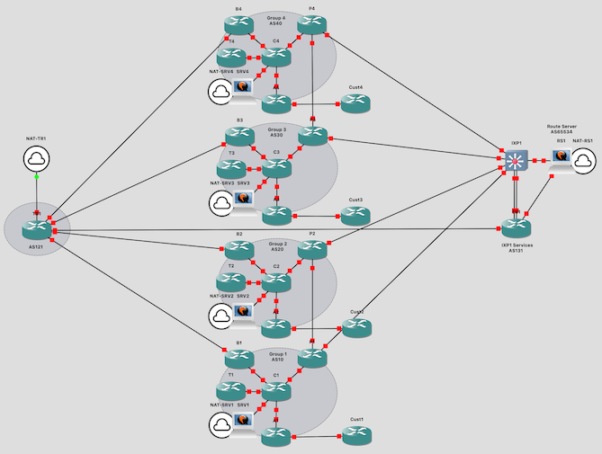
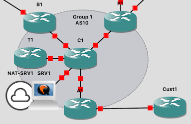
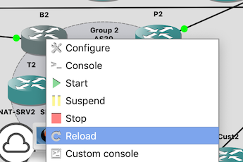

# Routing Infrastructure and Security Operations (RISO)

This workshop teaches the skills required for the configuration of scalable
and secure routing, as well as best practice operation of the networks
making up today's Internet.

It runs with up to 8 groups.  Each block of four groups shares a transit
router (TRx), and connects to an exchange point with a switch (IXPx), a
services router (SRx), and an Ubuntu BIRD route server (RSx).



Each group contains:

* A border router (BX)
* A peering router (PX)
* A core router (CX)
* An access router (AX)
* A trigger router (TX)
* A customer router (CustX)
* An Ubuntu server (srvX)



Each srvX server has a backdoor connection onto the class 192.168.122.x
network to allow fast downloads, since the CSR1000v virtual router applies a
1Mbps throughput limit.  This is shown as a "NAT" connector in the topology.

# System requirements

The lab is built to run on two servers, each with 64GB of RAM.  The first
server runs topology "riso1" for groups 1-4, and the second server runs
topology "riso2" for groups 5-8.  It's fine to run only riso1 by itself if
you wish.

!!! Note
    The high RAM requirements are due to the AX, BX, CX and PX routers
    being CSR1000v to get the RPKI feature set, and these routers require
    3GB of RAM *each*.

The second server should be built identically to the first, except:

* Change the classroom IPv4 address from 192.168.122.1 to 192.168.122.8
* Change the classroom IPv6 address from fe80::1 to fe80::8
* Disable DHCP on the classroom network
* Edit gns3-shellinabox.py and change TARGET to 192.168.122.8

The first three can all be changed using `virsh net-edit default` followed
by a reboot:

```
<!-- before -->

  <ip address='192.168.122.1' netmask='255.255.255.0' localPtr='yes'>
    <dhcp>
      <range start='192.168.122.100' end='192.168.122.249'/>
    </dhcp>
  </ip>
  <ip family='ipv6' address='fe80::1' prefix='64'>
  </ip>

<!-- after -->

  <ip address='192.168.122.8' netmask='255.255.255.0' localPtr='yes'>
  </ip>
  <ip family='ipv6' address='fe80::8' prefix='64'>
  </ip>
```

The classroom LAN ports for the two servers should connect into the same
switch, into which the classroom wifi access point(s) also connect.

The second server does not need a WAN connection, except for initial setup,
or if you require remote management access.

The easiest way to manage two GNS3 topologies at the same time is to use the
web interfaces:

* <http://192.168.122.1:3080/> for server 1
* <http://192.168.122.8:3080/> for server 2

You *can* add multiple servers to the standalone GNS3 GUI, but you may need
to keep switching between topologies - in which case, you should be very
careful to ensure that the option *"Leave this project running in the
background when closing GNS3"* is enabled on both projects.

# Files

You will need the following files:

File | Description
:--- | :----------
`hosts-riso` | `/etc/hosts` file to go on first server
`riso1-<version>.gns3project` | GNS3 project for groups 1-4
`riso2-<version>.gns3project` | GNS3 project for groups 5-8
`riso-rs<N>-hdb-<version>.img` | cloud-init configs for Route Servers (RS)
`riso-srv<N>-hdb-<version>.img` | cloud-init configs for SRV in each group
`nsrc-rs-<version>.qcow2` | VM image with bird preinstalled, for RS and SRV instances
`CSRv_boot_config.iso` | Initial configuration for CSR1000v
`vios-adventerprisek9-m.vmdk.SPA.157-3.M3` | IOSv image
`vios_l2-adventerprisek9-m.SSA.high_iron_20180619.qcow2` | IOSvL2 image
`csr1000v-universalk9.16.6.1.qcow2` | CSR1000v image

The total memory allocation of all the devices is 58GB.  There should still
be enough RAM to run the NOC.

!!! Note
    All of the CSRv routers are uncompressing identical images, and
    eventually ksm will kick in, sharing pages and freeing RAM.  With
    default ksm settings this takes several hours.

# Backbone addressing plan

IP Address      | DNS Name
:-------------- | :---------------------------
192.168.122.1   | vtp.ws.nsrc.org (server for groups 1-4)
192.168.122.2   | tr1.ws.nsrc.org
192.168.122.3   | tr2.ws.nsrc.org
192.168.122.5   | rs1.ws.nsrc.org
192.168.122.6   | rs2.ws.nsrc.org
192.168.122.8   | vtp2.ws.nsrc.org (server for groups 5-8)
192.168.122.10  | srv1.ws.nsrc.org
192.168.122.20  | srv2.ws.nsrc.org
192.168.122.30  | srv3.ws.nsrc.org
192.168.122.40  | srv4.ws.nsrc.org
192.168.122.50  | srv5.ws.nsrc.org
192.168.122.60  | srv6.ws.nsrc.org
192.168.122.70  | srv7.ws.nsrc.org
192.168.122.80  | srv8.ws.nsrc.org

See the training materials for the addressing plan used inside the network.

# Credentials

These passwords are shared with the students:

Device          | Username | Password | Enable
:-------------- | :------- | :------- | :-------
Student routers | `isplab` | `lab-PW` | `lab-EN`
Student SRV     | `isplab` | `lab-PW` |

(In the initial state "00-blank", the student routers are unconfigured)

The instructor logins are not shared with the students:

Device          | Username | Password  | Enable
:-------------- | :------- | :-------- | :--------
TRx, SRx, IXPx  | `nsrc`   | `nsrc-PW` | `nsrc-EN`
RSx             | `nsrc`   | `nsrc-PW` |

The `isplab` / `lab-PW` login also works on these devices, so that students
can inspect the state of the infrastructure, e.g. show BGP status, although
they will not know the enable password.

On the route servers, the `isplab` account is not able to `sudo` - but it is
in group `bird` so they can read `bird.conf` and interact using `birdc`.

# Snapshots

There are pre-generated snapshots for many different stages of the lab.

Normally this class starts with the routers and switches completely
unconfigured.  You can reset to this state using the "00-base" snapshot
(note that the transit and IXP routers *are* configured in this snapshot).  The
uplinks from the IXP services router (SR) are shut down, so that the IXP
services subnets do not appear in the initial BGP routing table.

You can restore to any given snapshot using `Edit > Manage Snapshots` in the
GNS3 client.  Beware that when you restore from a snapshot it will reset
*all* of the devices - including the Linux servers - and you will also lose
any changes you've made to the network topology itself.

Use the `gns3man` tool if you want to restore the configuration of an
individual device.

## Problem with CSR1000v snapshot restore

There is an intermittent problem with CSR1000v snapshot restore - you may
find some devices ignore the prepared configuration and instead go into the
"initial configuration" dialog.  Any affected routers can be fixed simply by
right-clicking in the GNS3 GUI and reloading them:



Alternatively, a faster way is to say "no" to the configuration dialog, get
to the router prompt and do `copy flash:config running`, as follows:

```
         --- System Configuration Dialog ---

Would you like to enter the initial configuration dialog? [yes/no]: no

Would you like to terminate autoinstall? [yes]:

<lots of stuff>

Router>en
Router#copy flash:config.txt running-config
Destination filename [running-config]?
% Warning: use /31 mask on non point-to-point interface cautiously
... etc
```

If you are restoring the entire class to a later stage, a quick way to check
them is to login just to the core routers (CX).  If any shows the initial
configuration dialog, then fix it.  Once you are able to login, check all
the expected IS-IS neighbors are present:

```
Routing Infrastructure and Security Operations Workshop
          Network Startup Resource Center


User Access Verification

Username: isplab
Password:

C2>sh isis neighbors

Tag as20:
System Id       Type Interface     IP Address      State Holdtime Circuit Id
P2              L2   Gi2           100.68.2.19     UP    21       01
A2              L2   Gi3           100.68.2.21     UP    23       01
T2              L2   Gi5           100.68.2.23     UP    29       00
C2>
```

In the above example, B2 is missing, so it would also be necessary to
fix B2.
